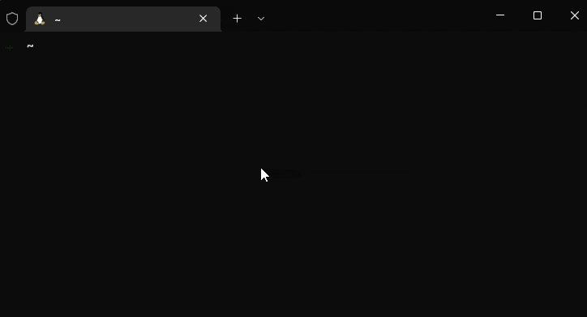
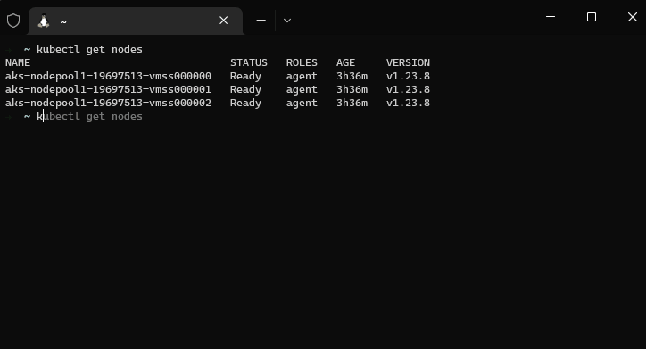

    


# kubectl-exec:
Kubectl-exec is an interactive bash script that allows you to perform tasks on Windows and Linux kubernetes nodes. Such as accessing nodes shell, mounting a node filesystem, and accessing nodes filesystem in an easy-to-use web interface. 

<br/>

# Key Features

- Access Windows/Linux nodes shell interactively<br>



- Access Windows/Linux nodes shell non-interactively



- Mount Windows/Linux filesystem to pod, can be used to explore or transfer files.


- Expose a web based file manager for managing files and folders and transfer data between nodes and your local machine.


# How it works:

**For Linux:** <br>It works by creating a pod (with a priviledged container) in the node you specified and using nsenter for getting a shell into your kuberntes nodes.

The created pod is from alpine official image which is ~2.6 mb in size, once you exit the shell, the pod will be deleted.<br>

**For Windows:**:<br>It works by creating a pod and using Windows SSH credentials to access Windows node or mounting the filesystem to the linux pod.

**Why using linux pods to access Windows nodes ?** <br>
This is because windows container images are large in size 3GB+; instead, we are using a linux alpine image that is less than 3MB.

> Notice: Windows nodes supports only nodes with OpenSSH installed. 
https://docs.microsoft.com/en-us/windows-server/administration/openssh/openssh_install_firstuse

> This have been tested on AKS nodes which has OpenSSH installed by default.

<br>

## Installation:
```bash
wget https://github.com/mohatb/kubectl-exec/raw/master/kubectl-exec
chmod +x ./kubectl-exec
sudo mv ./kubectl-exec /usr/local/bin/kubectl-exec
```

## Updating:
```bash
sudo rm -rf $(which kubectl-exec)
wget https://github.com/mohatb/kubectl-exec/raw/master/kubectl-exec
chmod +x ./kubectl-exec
sudo mv ./kubectl-exec /usr/local/bin/kubectl-exec
```

## Usage:
```bash
Interactive:
    kubectl-exec
    
Non-Interactive:
    kubectl-exec NodeName

Examples:
    Access node shell:
    kubectl-exec
    kubectl-exec NodeName
    
    Mount The host filesystem to priviliged pod:
    kubectl-exec -mount
    kubectl-exec -mount NodeName

    Access node filesystem with web interface in the browser:
    kubectl-exec -filemanager
    kubectl-exec -filemanager NodeName
```
<br>

# Troubleshooting:
Please refer to troubleshooting section [Troubleshooting](Troubleshooting.md)<br><br>

# Contributing
We welcome pull requests with open arms! There's a lot of work to do here, and we're especially concerned with ensuring the longevity and reliability of the project.
<br><br>

## Contributors

<a href="https://github.com/mohatb/kubectl-exec/graphs/contributors">
  
</a>

# License

This project is licensed under the [Apache License, Version 2.0](LICENSE).
